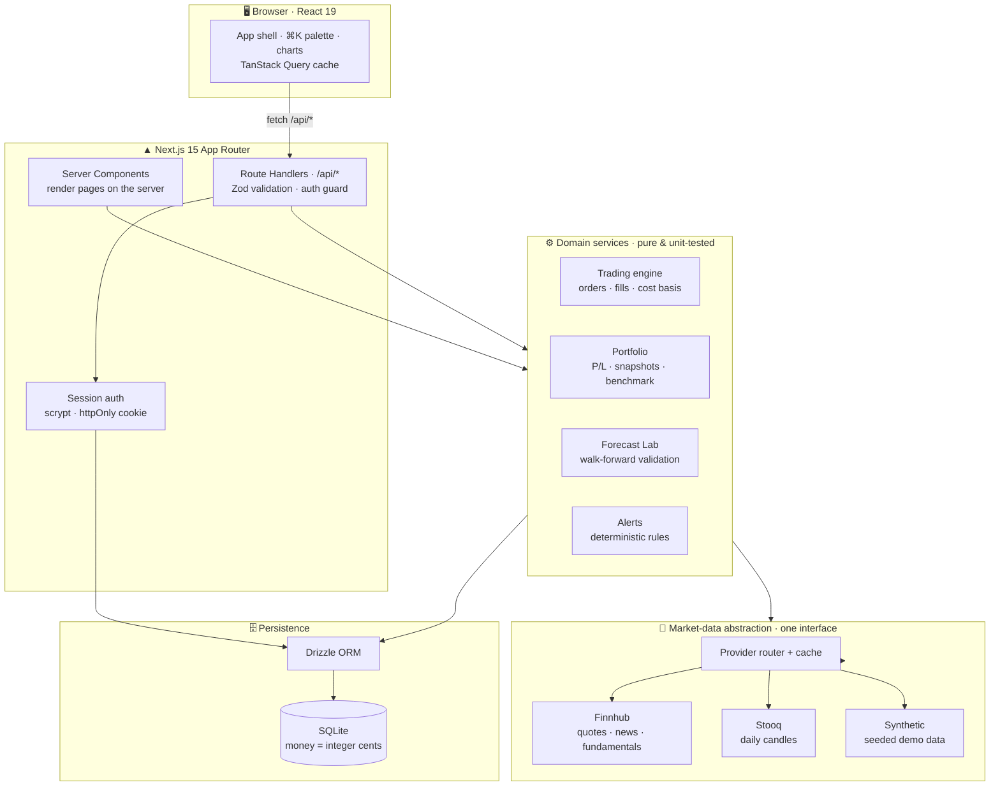
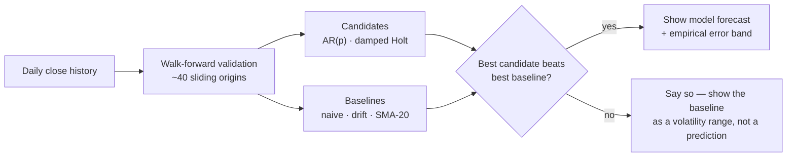

<div align="center">

# ◧ Basis

### An evidence-based investing workbench — _know why you own it._

Research stocks · honest statistical forecasts · paper trading with exact accounting

<br/>

[](https://github.com/shreyas463/Stock-Analysis-platform/actions/workflows/ci.yml)
[](LICENSE)


[**Quick start**](#-quick-start) · [Features](#-features) · [Architecture](#-architecture) · [Tech stack](#-tech-stack) · [Deploy](#-deployment)

</div>

---

**Basis** is a full rebuild of this repository's original stock-analysis platform into a single,
self-contained TypeScript application for practicing a disciplined investing process —
**research → decide → practice → review** — with paper money, never real money.

Its guiding principle is **data honesty**: every number on screen knows where it came from and when,
and the app would rather show you an empty state than a fabricated one.

> [!NOTE]
> Basis is an educational tool. Nothing it displays is financial advice, and simulated results do
> not predict real returns.

<div align="center">

[](https://render.com/deploy?repo=https://github.com/shreyas463/Stock-Analysis-platform)

_Demo login once it's up · `demo@basis.app` / `demo1234`_

</div>

---

## ✦ Features

|                            |                                                                                                                                                                                                                                                                                                                                                              |
| -------------------------- | ------------------------------------------------------------------------------------------------------------------------------------------------------------------------------------------------------------------------------------------------------------------------------------------------------------------------------------------------------------ |
| 🔬 **Stock research**      | One fast page per symbol: candlestick/line charts with SMA · Bollinger · RSI overlays and SPY comparison, fundamentals with plain-English tooltips, and company news.                                                                                                                                                                                        |
| ⭐ **Forecast Lab**        | The flagship. Real models (AR(p) on returns — an ARIMA(p,1,0) equivalent — and damped Holt smoothing) compete against naive baselines in **walk-forward validation**. A model is surfaced _only_ if it beats the best baseline; otherwise Basis says so out loud. Bands are empirical quantiles of real out-of-sample error — no invented confidence scores. |
| 💹 **Paper trading**       | Market · limit · stop · stop-limit orders, fractional shares, 5 bps slippage, buying-power and share checks, idempotency keys — every fill inside a single SQLite transaction so a crash can't create or destroy money.                                                                                                                                      |
| 📊 **Portfolio**           | Positions with average-cost basis, realized & unrealized P/L, daily value snapshots, and a benchmark line vs. SPY.                                                                                                                                                                                                                                           |
| 👁️ **Watchlists & alerts** | Multiple lists with notes and entry/exit targets; price, %-move, RSI, volume-spike, MA-cross and drawdown alerts evaluated deterministically and delivered in-app.                                                                                                                                                                                           |
| 🎯 **Data honesty**        | Every price carries `source`, `asOf`, and `synthetic`/`stale` flags rendered in the UI. A failed feed becomes an error state — never invented numbers.                                                                                                                                                                                                       |
| 🎨 **Crafted UI**          | Custom design system on Tailwind 4 (full dark **and** light themes), ⌘K command palette, keyboard-friendly, responsive, `prefers-reduced-motion` respected, with skeleton / empty / error states everywhere.                                                                                                                                                 |

---

## ⛭ Architecture

A single Next.js process owns the whole stack — UI, API, domain logic, and an embedded SQLite
database. Providers sit behind one interface, so market data can be live or synthetic without the
rest of the app knowing the difference.



**Why it's shaped this way**

- **Money is never a float.** Balances are integer **cents**; share quantities are integer
  **ten-thousandths** of a share. Every trade runs in a DB transaction with an idempotency key.
- **One market-data seam.** Nothing outside `lib/market-data` talks to a provider. Swapping Finnhub,
  adding a source, or forcing demo mode is a one-file change — and provider keys never reach the browser.
- **Honest by construction.** Synthetic demo data is deterministic and permanently labeled; a live
  feed that fails degrades to the last cached close marked _Delayed_, or to an error — never a guess.

More detail — the money model, forecast methodology, and the audit that motivated the rebuild —
lives in **[ARCHITECTURE.md](ARCHITECTURE.md)**.

---

## ⭐ Forecast Lab — how the forecasting actually works

The original app's "AI advisor" added `random.uniform(-5, 5)` to its confidence scores and hardcoded
"good buy" when data was missing. The Forecast Lab is the honest replacement, built on one idea:
**never show a forecast unless it provably beats a naive guess in out-of-sample testing.**

### The models it runs

| Kind           | Models                                                                                                                              |
| -------------- | ----------------------------------------------------------------------------------------------------------------------------------- |
| **Candidates** | **AR(p)** on log-returns (an ARIMA(p, 1, 0) equivalent; order chosen by AIC) and **damped Holt** exponential smoothing (grid-tuned) |
| **Baselines**  | **Naive** (tomorrow = today's close) · **random walk with drift** · **20-day moving average**                                       |

Everything is computed in plain TypeScript (`lib/services/forecast.ts`) on log prices — no Python,
no ML library, fully deterministic and unit-tested.

### What "walk-forward validated" means

You can't judge a time-series model by testing it on data it trained on — that leaks the future and
makes any model look brilliant. **Walk-forward validation** slides a cutoff ("origin") forward through
history; at each origin the model is refit on **only the data before it**, forecasts _h_ days ahead,
and is scored against what **actually** happened. Averaging that error over ~40 origins simulates
using the model in real time, again and again — an honest estimate of real-world accuracy.

```
time ─────────────────────────────────────────────────────────▶

origin 1   [■■■■■■■ train ■■■■■■■]┊ forecast h days → compare to actual
origin 2   [■■■■■■■■ train ■■■■■■■■]┊ forecast h days → compare to actual
origin 3   [■■■■■■■■■ train ■■■■■■■■■]┊ forecast h days → compare to actual
   ⋮                        ⋮                     ⋮
origin 40  [■■■■■■■■■■■■ train ■■■■■■■■■■■■]┊ forecast → compare
                                   │
                    the model only ever sees data to the LEFT of ┊
                    (no look-ahead) — errors are averaged as MAPE + MAE
```

### The pipeline



### The honesty rules

- **Beat-the-baseline gate** — a real model is surfaced _only_ if it beats the best baseline by a
  meaningful margin (relative MAPE). If nothing beats "just guess today's price," Basis says so.
- **Real error bands** — the shaded prediction interval is the **empirical 10th–90th percentile of
  the model's own out-of-sample errors**, not an invented confidence score.
- **No look-ahead** — hyper-parameters are tuned on a slice _before_ the validation window, so even
  model selection is out-of-sample.
- **Stated limits** — every forecast lists what it ignores (earnings, news, intraday moves) and that
  past error does not bound future error. Full methodology in [ARCHITECTURE.md](ARCHITECTURE.md#forecast-lab-methodology).

---

## ⚒ Tech stack

| Layer             | Exactly what's used                                                                                                       |
| ----------------- | ------------------------------------------------------------------------------------------------------------------------- |
| **Framework**     | `next@15` (App Router + React Server Components) · `react@19` · `typescript` (`strict` + `noUncheckedIndexedAccess`)      |
| **UI**            | `tailwindcss@4` · Radix UI primitives · custom design tokens (full dark + light) · `lucide-react` icons · `cmdk` (⌘K)     |
| **State & forms** | `@tanstack/react-query` (server cache) · `react-hook-form` + `zod` (validation) · `next-themes` · `sonner` (toasts)       |
| **Charts**        | `lightweight-charts` (candlestick / price) · `recharts` (portfolio & analytics)                                           |
| **Backend**       | Next.js Route Handlers · session auth — `scrypt` password hashing + httpOnly cookies (no external auth SDK) · `zod` I/O   |
| **Database**      | SQLite via `better-sqlite3` · `drizzle-orm` + `drizzle-kit` migrations · money as **integer cents**, quantities as **E4** |
| **Forecasting**   | Hand-written AR(p) / damped-Holt + naive baselines in TypeScript — walk-forward validated, no Python / ML dependency      |
| **Market data**   | One provider interface → Finnhub (live quotes/news/fundamentals) · Stooq (EOD candles) · deterministic synthetic (demo)   |
| **Quality**       | `vitest` (30 unit tests) · `playwright` (e2e) · ESLint (`no-explicit-any` = error) · Prettier · GitHub Actions CI         |
| **Deploy**        | `Dockerfile` · Render (`render.yaml`) / Railway (`railway.json`) / Fly.io                                                 |

---

## ⚡ Quick start

```bash
git clone https://github.com/shreyas463/Stock-Analysis-platform.git
cd Stock-Analysis-platform
npm run setup     # install + migrate + seed the demo account
npm run dev       # → http://localhost:3000
```

Sign in with **`demo@basis.app` / `demo1234`**, or register your own account. With zero
configuration Basis runs in **demo mode** — deterministic synthetic market data, clearly labeled
on every surface, no external calls, works offline.

### Optional: live market data

```bash
cp .env.example .env.local
```

| Variable          | Required      | Purpose                                                                                            |
| ----------------- | ------------- | -------------------------------------------------------------------------------------------------- |
| `SESSION_SECRET`  | in production | Signs session cookies — `node -e "console.log(require('crypto').randomBytes(32).toString('hex'))"` |
| `FINNHUB_API_KEY` | optional      | Live quotes, search, fundamentals, news ([free tier](https://finnhub.io)) — server-side only       |
| `STOOQ_ENABLED`   | optional      | Free end-of-day price history (default on in live mode)                                            |
| `DATABASE_PATH`   | optional      | SQLite file location (default `./data/basis.db`)                                                   |
| `DEMO_MODE`       | optional      | Force demo mode even with keys present                                                             |

### Commands

```bash
npm run dev          # dev server
npm run build        # production build
npm test             # unit tests — money math, trading engine, forecast honesty, indicators
npm run test:e2e     # Playwright smoke suite
npm run lint         # eslint (no-explicit-any is an error)
npm run typecheck    # tsc --noEmit (strict + noUncheckedIndexedAccess)
```

---

## 🚀 Deployment

**One click, free:** the [Deploy to Render](https://render.com/deploy?repo=https://github.com/shreyas463/Stock-Analysis-platform)
button reads `render.yaml`, builds the Dockerfile, and generates `SESSION_SECRET` automatically.

Or any container host with a persistent disk (**[DEPLOYMENT.md](DEPLOYMENT.md)** has Railway / Fly steps):

```bash
docker build -t basis .
docker run -p 3000:3000 -v basis-data:/app/data -e SESSION_SECRET=<hex> basis
```

> [!IMPORTANT]
> Serverless platforms (Vercel / Netlify / GitHub Pages) **can't run Basis** — their filesystems are
> ephemeral or static-only, so the on-disk SQLite database, sessions and trades wouldn't persist.
> Use a container host, or contribute a libSQL/Postgres driver swap (Drizzle keeps the schema portable).

---

## 📉 Data sources & limitations

- **Demo mode** — prices come from a seeded geometric Brownian walk: great for learning the workflow,
  meaningless for real research, and labeled as such everywhere.
- **Live mode** — Finnhub free-tier quotes may be delayed; Stooq history is end-of-day only. News and
  fundamentals coverage varies by symbol; missing values render as `—`, never as invented numbers.
- **Forecasts** extrapolate daily closes only. They know nothing about earnings, news or intraday
  moves, and past validation error does not bound future error.

---

## 📚 Docs

|                                    |                                                                                 |
| ---------------------------------- | ------------------------------------------------------------------------------- |
| [ARCHITECTURE.md](ARCHITECTURE.md) | System design, the money model, forecast methodology, and the legacy-code audit |
| [SECURITY.md](SECURITY.md)         | Threat model, auth design, and the previously-committed API keys                |
| [DEPLOYMENT.md](DEPLOYMENT.md)     | Render / Railway / Fly.io / Docker, and retiring the old Vercel deploy          |
| [CONTRIBUTING.md](CONTRIBUTING.md) | Local workflow and quality gates                                                |

---

<div align="center">

Built as a full-stack engineering showcase — backend, frontend, data, and system design.

**MIT** licensed · see [LICENSE](LICENSE)

</div>
